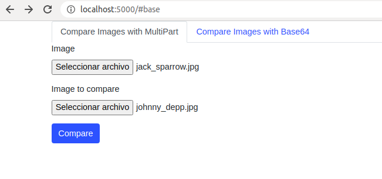

# Teotl
## API for recognition and comparation facial
### Introduction 🚀
> Rest api service to detect faces, with the ability to detect similarities  in two images.
#### Example
The project includes a template for testing
> 

<table>
    <thead>
    <td><b>user_profile_picture</b></td>
    <td><b>user_webcam_photo</b></td>
    <td><b>Result</b></td>
    </thead>
    <tr>
    <td>
    
    </td>
    <td>
    
    </td>
    <td>
    
    </td>
    </tr>
    <tr>
    <tr>
    <td>
    
    </td>
    <td>
    
    </td>
    <td>
    
    </td>
    </tr>
    </tr>
</table>

## Create with
* python: version 3.6
* Flask 1.1.2
* face-recognition 1.3.0
## Installation 🔧

* python3 -m venv ./venv
* source venv/bin/activate
* pip3 install -r requirements.txt
* export FLASK_APP=main.py
* flask run

## Functions ⚙️

> **/compareFaces** [POST]
>> compare two images to find facial similarities (with format Base64 JSON)
>> ### Parameters Request
>> * user_profile_picture : Base 64 encode string of person
>> * user_webcam_photo : Base 64 encode string imagen to compare
>> ### Response
>> * 'True' : two images container faces similarities
>> * 'False' : two images not container similarities, or not container faces, or not container a parameter request
---
> **/compareFacesPath** [POST]
>> compare two images to find facial similarities (with format Path request file)
>> ### Parameters Request
>> * user_profile_picture : file of person
>> * user_webcam_photo : file imagen to compare
>> ### Response
>> * 'True' : two images container faces similarities
>> * 'False' : two images not container similarities, or not container faces, or not container a parameter request
---
> **/detectFaces** [POST]
>> analyzes an image to detect faces (with format Path request file)
>> ### Parameters Request
>> * profile_picture : file imagen to search faces
>> ### Response
>> * 'True' : image container a face
>> * 'False' : imagen not container a face, or not exist parameter request
---
## **Settings**
These are the two parameters to adjust the image analysis (modify in config.py)
>TOLERANCE :if value is low,the result will be more strict (default 0.55)

>SIZE_CONVERT :Size to resize the images for better processing (default 128)
---
## License 📄
This project is under the license [LICENSE.md](LICENSE.md).

---

Create with ❤️ by [Carlos Mata](https://github.com/carlosmata96)